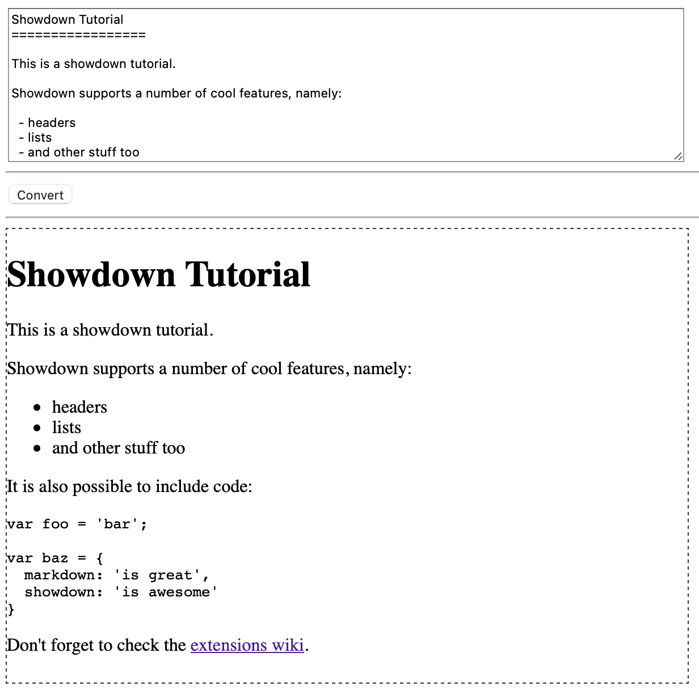

# Markdown editor with Showdown

## Introduction

In this tutorial, you will create a simple in-browser Markdown editor using Showdown and some of its extensions. The purpose is to show how easy it is to include and configure Showdown in your project.

The fully working example you can see in [Fiddle][1].

## Step 1: Prepare project

1. Install [node.js](https://nodejs.org/en/).
1. Install project package management tool

    !!! info ""
        Showdown core library doesn't have any dependencies so the setup is pretty straightforward. However, you are strongly encouraged to use a package manager such as [**npm**](http://npmjs.com) or [**yarn**](https://yarnpkg.com) to manage project dependencies.

    To install package management tool:

    1. Create a directory called `showdown-editor` and recreate the following structure:

        ```
        showdown-editor
        ├── css
        │   └── style.css
        ├── js
        │   └── script.js
        └── index.html
        ```

    1. Initialize `package.json` file by running the following interactive console command:

        ```
        npm init -y
        ```

        This command creates `package.json` file in the root of the project folder, and populates the default content that you can change later if you wish.

## Step 2: Install Showdown

Inside the `showdown-editor` directory, run the following command:

```
npm install showdown --save
```

This command will install `showdown` inside the `node_modules` directory and save `showdown` as a dependency in the `package.json` file.

## Step 3: Update project files

Add the following content to the corresponding project files:

=== "index.html"

    ```html
    <!DOCTYPE HTML>
    <html>
    <head>
      <meta charset="UTF-8"/>
      <link rel="stylesheet" href="css/style.css"/>
    </head>
    <body>
      
      <textarea id="sourceTA" rows="10" cols="82">
    Showdown Tutorial
    =================

    This is a showdown tutorial. 

    Showdown supports a number of cool features, namely:

      - headers 
      - lists
      - and other stuff too
      
    It is also possible to include code:

        var foo = 'bar';
        
        var baz = {
          markdown: 'is great',
          showdown: 'is awesome'
        }

    Don't forget to check the [extensions wiki][1].

    [1]: https://github.com/showdownjs/showdown/wiki/extensions
      </textarea>
      <hr/>
      <button id="runBtn" onClick="run()">Convert</button>
      <hr/>
      <div id="targetDiv"></div>
      
      <script src="node_modules/showdown/dist/showdown.min.js"></script>
      <script src="js/script.js"></script>
    </body>
    </html>
    ```

    !!! warning ""
        Please note how Showdown and the script file are included to the `index.html` via the `script` tag at the bottom of the file.

=== "style.css"

    ```css
    #sourceTA {
      display: block;
    }
    #targetDiv {
      border: 1px dashed #333333;
      width: 600px;
      height: 400px;
    }
    ```

=== "script.js"

    ```js
    function run() {
      var text = document.getElementById('sourceTA').value,
      target = document.getElementById('targetDiv'),
      converter = new showdown.Converter(),
      html = converter.makeHtml(text);
      
      target.innerHTML = html;
    }
    ```

    The `script.js` file is simple: when the `runBtn` button is clicked, the script gets the text of the textarea, passes it through Showdown to convert the markdown text into HTML. The resulting HTML is then put inside the `targetDiv`, replacing the previous content.

## Step 4: Check the result

1. Open your `index.html` file. You should see your editor with prefilled markdown text in the text area.
1. Click `Convert` button. You show see the text to be converted to HTML:

    

The fully working example you can see in [Fiddle][1].

## Conclusion

Congratulations! :tada: You have successfully created a simple Markdown editor!

[1]: http://jsfiddle.net/tivie/6bnpptkb/